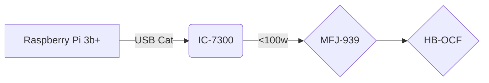

```mermaid
graph LR
A[Raspberry Pi 3b+] -- USB Cat --> B(IC-7300)
B -- <100w  --> D{MFJ-939}
D --> E{HB-OCF}


```
> Written with [StackEdit](https://stackedit.io/).
<!--stackedit_data:
eyJoaXN0b3J5IjpbMTU2NTM2MDIyXX0=
-->