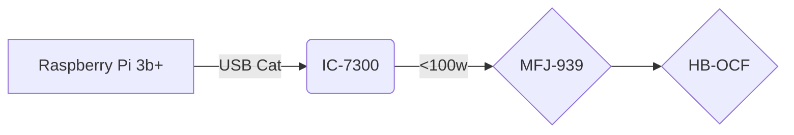

# Station Info

### ++[Home](home.md) ++[Station Info](station.md)++[On The Air](ontheair.md)++[Online Radio Clubs & Organizations](clubs.md)++[Projects](projects.md)++[JS8Call Operating Suggestions and Information](js8help.md)
---
Power provided via Solar Panels and scrounged lead acid batteries 
(until budget allows for upgrade)

# well, that worked great. good job >.< 
# no, i don't know how to fix it. 

---
  "Talking to Aliens" v050120200900
<!--stackedit_data:
eyJoaXN0b3J5IjpbLTQ3MTg0NTQzNCwtMTY4MzIzNjQ5MywyMD
A3OTU2Nzc2XX0=
-->