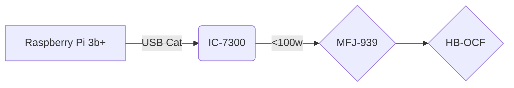

# Station Info

### ++[Home](index.md) ++[Station Info](station.md)++[On The Air](ontheair.md)++[Online Radio Clubs & Organizations](clubs.md)++[Projects](projects.md)++[JS8 mode info/help](js8help.md)
---
Power provided via Solar Panels and scrounged lead acid batteries 
(until budget allows for upgrade)

well, that worked great. good job >.< 
this was supposed to be this snazzy flowchart thing built in named "mermaid" which apparently has been beached.  no, i don't know how to fix it. 

---
  "Talking to Aliens" 
<!--stackedit_data:
eyJoaXN0b3J5IjpbLTE5MDgzMzUxOTksMTk4Mzk2ODMzMywtMT
Y4MzIzNjQ5MywyMDA3OTU2Nzc2XX0=
-->