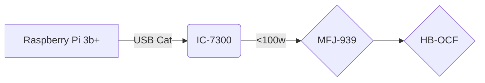

# Station Info

---
Power provided via Solar Panels and scrounged lead acid batteries 
(until budget allows for upgrade)

---
  "Talking to Aliens" v050120200900
<!--stackedit_data:
eyJoaXN0b3J5IjpbMjAwNzk1Njc3Nl19
-->